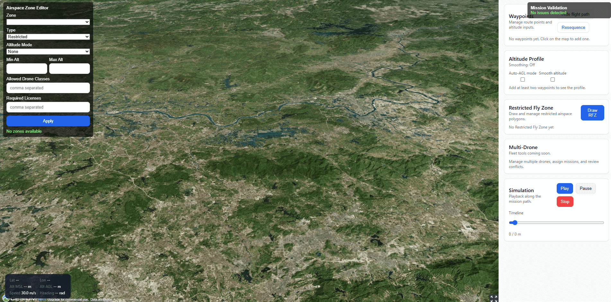
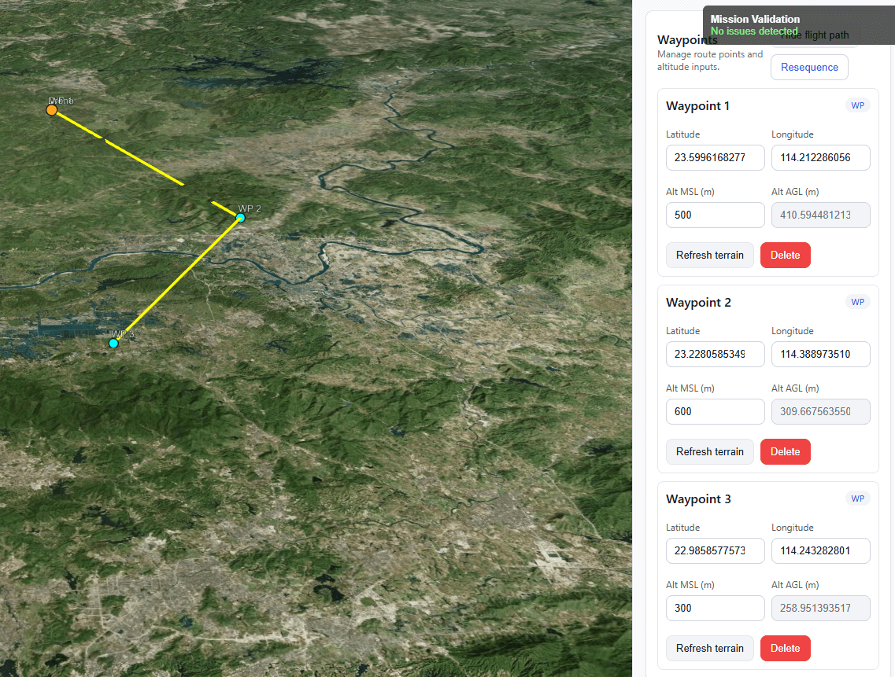
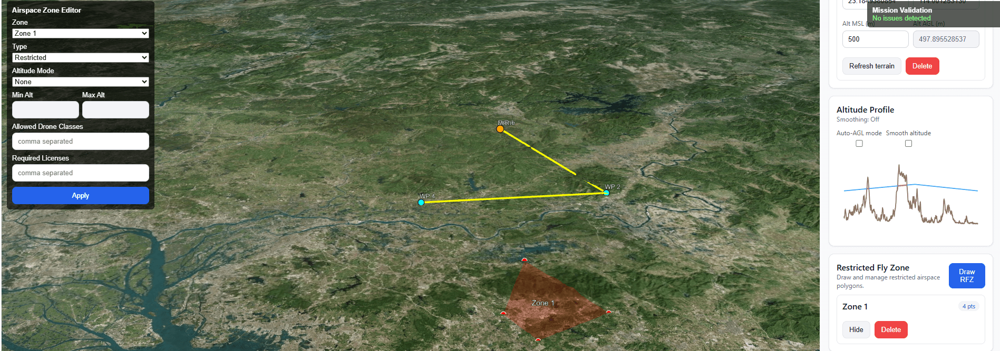
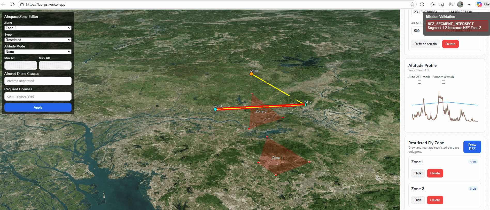

3D Drone Mission Planner (CesiumJS + React + Vite)
A front end–only 3D drone mission planning application built with CesiumJS, React, Vite, and Zustand.
This project demonstrates real-world geospatial workflows including polygon drawing for no fly zone, mission planning, and airspace safety validation.

________________________________________
🌐 **Live Demo**  
🔗 https://lae-psi.vercel.app/  

This is the deployed version of the 3D Drone Mission Planner.
________________________________________
✅ **FULL NARRATIVE**  

📘 **Project Narrative**  
This project is a 3D Drone Mission Planner built with CesiumJS, React, Vite, and Zustand. It allows operators to draw airspace zones, create waypoint‑based missions, and validate routes against No‑Flight Zones (NFZs). The goal is to demonstrate practical CesiumJS expertise through a real-world geospatial workflow.

**Why I Built This**  
This application is part of a larger vision to build a full SaaS platform for drone safety, routing, and telemetry. The front‑end version serves as a prototype to refine domain models and demonstrate Cesium proficiency before migrating to a backend with Node.js  and PostGIS.

**Steps Involved**  
•	Designed a domain model for missions, waypoints, and airspace zones  
•	Integrated CesiumJS into a modern React + Vite environment 
•	Implemented interactive polygon drawing for NFZs and risk zones 
•	Built waypoint creation and editing tools 
•	Rendered mission routes using Cesium polylines 
•	Implemented a validation engine to detect NFZ violations 
•	Created UI panels for zones, missions, and validation results 
•	Ensured clean separation between domain logic, Cesium rendering, and UI 

**Final Result** 
A fully interactive 3D mission planner demonstrating Cesium entity management, geospatial validation, and operator‑friendly UI design. The application runs entirely in the browser and is suitable for Cesium Certified Developer evaluation.

**Next Steps**
•	Add automatic routing (A*)
•	Add building footprints and altitude‑aware routing
•	Add telemetry visualization
•	Migrate domain logic to a multi‑tenant backend

________________________________________
✅ **ARCHITECTURE DOCUMENTATION**  

🏗 **Architecture Overview**
This application follows a clean, layered architecture designed for clarity, maintainability, and future scalability.

**1. React Layer (UI)**
•	Implements panels for zones, missions, and validation
•	Handles user interactions
•	Uses Zustand for global state
•	Contains no Cesium logic

**2. Cesium Layer (Visualization)**
•	Initializes the Cesium viewer
•	Renders polygons, polylines, labels, and waypoints
•	Handles scene updates and camera interactions
•	Receives instructions from the domain layer

**3. Domain Layer (Logic)**
•	Pure functions for:
	o	Mission validation
	o	Zone modeling
	o	Waypoint management
•	Contains no Cesium or React imports
•	Designed to be portable to a backend later

**Data Flow**
User → React UI → Zustand State → Domain Logic → Cesium Rendering  

**Why This Architecture**
•	Keeps Cesium isolated and testable
•	Keeps domain logic portable
•	Supports future backend migration
•	Ensures maintainability and clarity

🧩 **UI Panels Overview**
The application is organized into focused UI panels to support an operator-friendly workflow:

**Zone Panel**
•	Lists all defined airspace zones
•	Allows creating, renaming, and deleting zones
•	Uses color coding to match zone types
•	Manages airspace constraints

**Mission Panel**
•	Displays the mission’s waypoints
•	Shows waypoint index and position
•	Allows clearing or adjusting the mission
•	Works closely with the globe for visual confirmation

**Validation Panel**
•	Shows safety check results
•	Highlights violations visually
•	Links globe feedback with structured panel data
•	Helps operators understand unsafe mission segments

________________________________________
✅ **CESIUM FEATURES USED**
🛰 CesiumJS Features Demonstrated
This project uses several intermediate CesiumJS features:

**Entity API**
•	Polygons for zones
•	Polylines for mission routes
•	Points for waypoints
•	Labels for zone names

**Interactive Drawing**
•	Click‑to‑add polygon vertices
•	Click‑to‑add waypoints
•	Real‑time updates to entities

**Dynamic Updates**
•	Live updates to polylines when waypoints move
•	Zone styling updates based on type

**Scene & Camera**
•	Globe navigation
•	Entity focus (basic camera control)

**Geospatial Analysis**
•	Validation logic checks intersections between mission segments and NFZ polygons

These features demonstrate practical CesiumJS usage in a real-world workflow.
________________________________________
🚀 **Features** 

**Airspace Zone Management**   
•	Draw polygon zones directly on the Cesium globe  
•	Supports No Flight Zones (NFZ)  
•	Editable zone names and properties  

**Mission Planning**   
•	Add waypoints by clicking on the globe  
•	Drag and reposition waypoints  
•	Automatic polyline route rendering  
•	Mission stored in Zustand global state  

**Safety Validation**  
•	Detects:   
	o	Waypoints inside NFZs  
	o	Segments intersecting NFZs  
•	Highlights violations visually  
•	Displays validation results in a UI panel  

**Clean Architecture**  
•	Domain logic isolated from Cesium and React  
•	Cesium viewer encapsulated in its own component  
•	Zustand for predictable global state  
•	Pure functions for validation and domain modeling  

________________________________________
🧱 **Tech Stack**  
•	React  
•	Vite  
•	CesiumJS  
•	Zustand  
•	TypeScript / JavaScript  

________________________________________
📦 **Installation**  
npm install  
npm run dev  

________________________________________
🏗 **Build for Production**  
npm run build  

🌐 **Deployment**  
Deploy the dist/ folder to Vercel:  
1. Go to https://vercel.com  
2. Import your GitHub repo  
3. Set:  
	o Framework: Vite  
	o Build command: npm run build  
	o Output directory: dist  
4. Deploy  

________________________________________
🎯 **Purpose**
This project is part of a larger initiative to build a full SaaS platform for drone safety, routing, and telemetry.
This version serves as a Cesium Certified Developer submission and demonstrates practical CesiumJS expertise.  

________________________________________
📸 **Screenshots**  

**1. Full‑Screen Cesium Globe View**
A wide view of the CesiumJS globe showing the mission‑planning environment. This screenshot demonstrates the clean UI layout, the 3D globe rendering, and the overall workspace where operators design missions and manage airspace zones.

**2. Mission Planning with Waypoints**
Here, the user has added multiple waypoints to define a mission route. Cesium renders the mission path as a polyline, and each waypoint is displayed as an interactive point entity. This demonstrates the mission‑planning workflow and real‑time visual updates.

**3. Drawing an Airspace Zone (Polygon Tool)**
This screenshot shows the interactive polygon‑drawing tool used to create No‑Flight Zones (NFZs). It highlights the user workflow for defining airspace constraints directly on the 3D globe.

**4. Validation Panel with Highlighted Violations**
This screenshot shows the validation results panel alongside the globe. The system detects when waypoints or route segments intersect No‑Flight Zones and highlights violations visually. This demonstrates geospatial analysis and safety‑checking logic integrated with Cesium.

________________________________________
🎥 **Video Demo**  
https://www.youtube.com/watch?v=jMl8S-H4ybA
This video will show the full workflow including zone creation, mission planning, and validation.

________________________________________
🛣 **Roadmap**
•	Automatic routing (A*)
•	Building footprints and altitude‑aware routing
•	Telemetry visualization
•	Backend migration (Node.js + PostGIS)
•	Mission export formats

________________________________________
**🏅 Cesium Certified Developer Submission Notes**
This repository contains all materials required for the Cesium Certified Developer application, including:

•	A working CesiumJS application  
•	Live demo link  
•	Full narrative  
•	Architecture documentation  
•	Cesium features used  
•	Screenshots demonstrating key workflows  

The project demonstrates practical CesiumJS usage in a real-world geospatial workflow, including polygon drawing, mission planning, and safety validation.

________________________________________
📄 **License**  
MIT License.  

